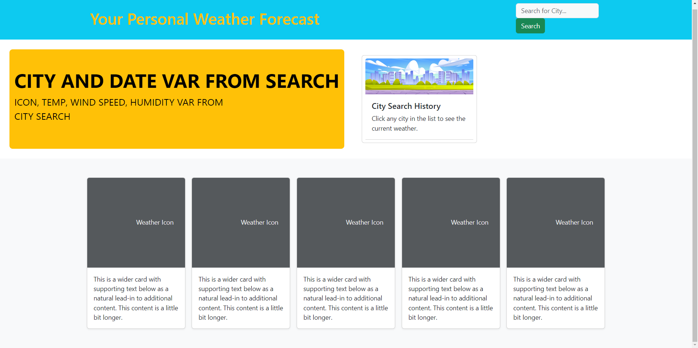

# Five Day Weather Forecast

## Description
This application allows you to search a city and get a 5 day weather forecast. You can better plan weekend activities, travel, or events to prepare for incliment weather.

## Visuals
The following image shows the web application's appearance. You can also go to the web application by clicking the following link. https://chelleyoungw.github.io/5-day-weather-forecast/

## Usage
Type in the city you would like to know the 5 day forecast for. Hit enter on the keyboard or click the search button. Today'
s weather info will populate into the yellow box. The next 5 days forecast will populate in the bottom 5 boxes. The city will populate a button in the search history. When you click on the button in search history, it will bring back the forecast data for that city.

## Authors and acknowledgment
Chelle Wood (student)
Bootstrap
<a href="https://www.freepik.com/free-vector/city-skyline-summer-time-urban-view-background_21427567.htm#query=cartoon%20city%20background&position=45&from_view=keyword&track=ais&uuid=379d3384-4dae-472c-b623-6c0268bc5b9b">Image by upklyak</a> on Freepik
API sourced from https://openweathermap.org/

## License
Refer to MIT License in Repo